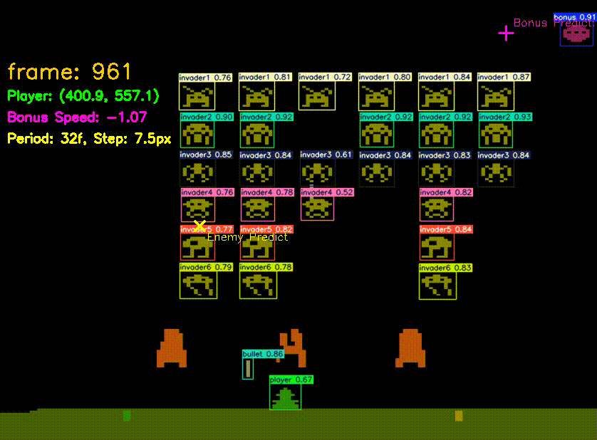
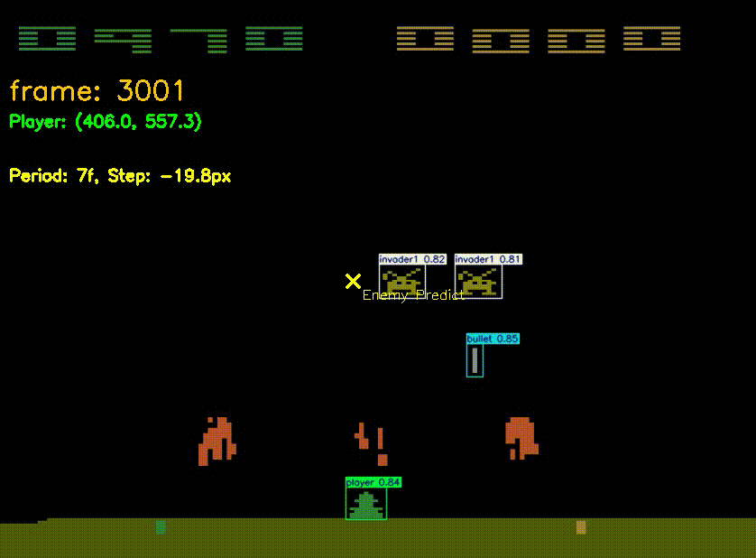
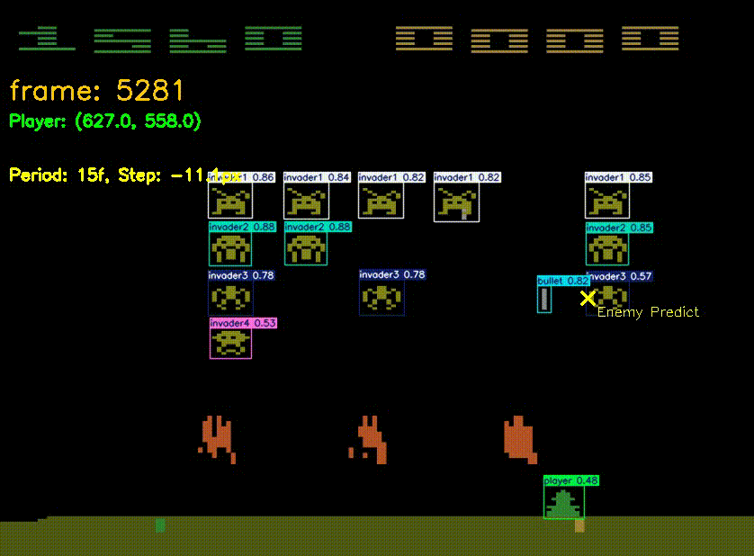

# Understanding of vision based model(yolo) of the game observation
First we transform the box of each detected entity into a x,y coordinate.
x = (xyxy[0]+xyxy[2])/2
y = (xyxy[1]+xyxy[3])/2
xyxy is the coordinate of the box’s Diagonal points.
### 1.Player：
At each frame, we will update its coordinate by the new detected result from yolo and every frame of the observation is sure to have a player box detected by yolo.
### 2.Enemy：
选择参考点： 从下往上遍历（invader6到invader1），找到第一个存在的敌人   # 选择该行最左边的敌人（因为已经按x排序）
实时监测参考点的X坐标变化
计算位移 dx = current_x - last_x
当 abs(dx) > 0.5 时，认为发生一次跳跃
记录：
pixels_per_step：每次跳跃的像素数（可正可负，表示方向）
frames_per_step：两次跳跃之间的帧数
如果已校准，但新的跳跃规律与之前不符（差异超过阈值），会重新校准
此外，敌人总数发生变化时（有敌人被击杀），重置校准状态，重新计算规律

### 3.Bullets：
Because in the game observations of every frame, only some frames can the bullets be found. Also, bullets will be hard to detected by yolo when it is near other entities. Therefore, we designed a mechanisim to address these problems.
(1.
We keep a list to store existing bullets. Each element will store the info of the bullet, its position, its direction, and a value(initialized as 20) indicating whether it need to be removed (reaching out of the screen or shot the shelter)
(2.
Each frame we will detect the bullets. If the bullet is very close to a existing bullet in the list, we will regard the new bullet a update of the close bullet already found and get the direction of the bullet.
(3.
We will decrease the value of every bullet and pop the ones reaches zero( means it vanishes)
### 4.Shooting:
We will keep a target coordinate value for the agent. The player will first check if it is safe(no bullets shooting at it), then move towards the target shooting position predicted(because we already get the speed and position information of every entities, we can easily calculate the predicted position).

### 5.Avoiding:
The player need to avoid the bullets. If any bullet is close to it,(abs(dx) < 60 and abs(dy) < 100
), it will know that it is in danger and move away the bullet and the other direction if it is cornered at the left and right Border.

### 6.Shelter： 
识别机制
ROI区域提取
   roi_y1, roi_y2, roi_x1, roi_x2 = 460, 517, 211, 602   # 从原始图像中提取掩体所在的矩形区域（大概范围）
HSV颜色空间转换
使用实测的黄色HSV值范围
生成二值掩码：掩体像素 = 1，背景 = 0
输出结果 返回一个形状为 (57, 391) 的二值矩阵
预测敌人未来位置，并检查从玩家位置到该位置的垂直路径是否被掩体阻挡。优先选择路径畅通的目标进行射击。

路径检测函数 ：
通道宽度 = 子弹宽度 + 容错边距
检查从ROI顶部到底部的整列（垂直通道）
如果没有掩体像素（和为0），路径畅通
目标选择策略（move_shoot()函数）

优先选择最后两排的敌人
如果没有，再选择更上方的敌人
如果所有目标的路径都被阻挡，退而求其次选择最近的目标（即使被挡住）

预测目标：使用 predict_enemy_x() 预测子弹到达时敌人的位置

### 7. ...

# Analysis of results
So far, the agent can shoot most of the invaders. Almost in every run of random seed, it can all the invaders except the last one.
The reason for that is the invaders will get faster and faster as their number decrease, even faster than the player. It is even harder for a human to shoot the last one.

Another reason is that yolo behaves bad when the invader’s speed is two high, in some frames, it can’t detect the invader resulting in wrong speed of it thus hard to shoot.

There is also a problem of yolo, when two different object is two close, for example, the shelter and the bullet, it can not detect the bullet with high confidence resulting in late avoidance of bullet. 